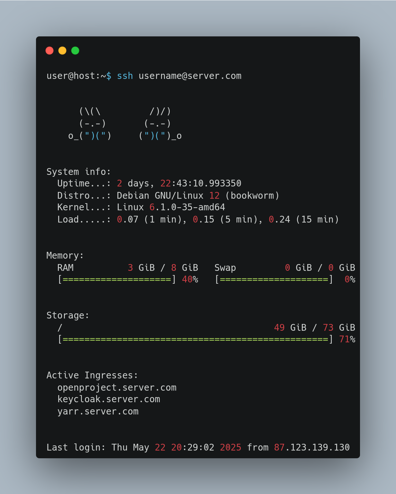

# motd

<center>



</center>

## Description

This script generates a dynamic message of the day (MOTD) for Linux systems. It displays system information such as uptime or system usage.

## Installation

1. Make sure you have the required dependencies listed in `requirements.txt` installed.
2. Copy the `10-motd.py` file to the `/etc/update-motd.d/` directory and make it executable:

```bash
sudo cp 10-motd.py /etc/update-motd.d/
sudo chmod +x /etc/update-motd.d/10-motd.py
```
